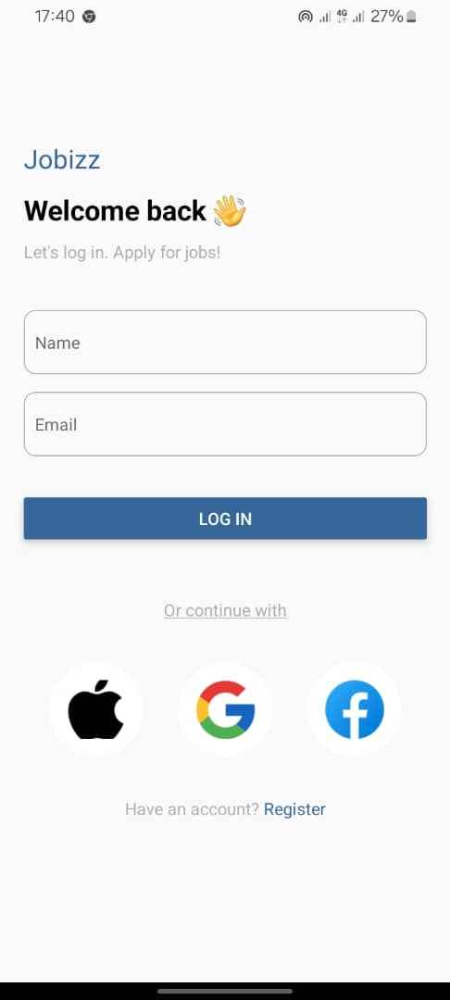
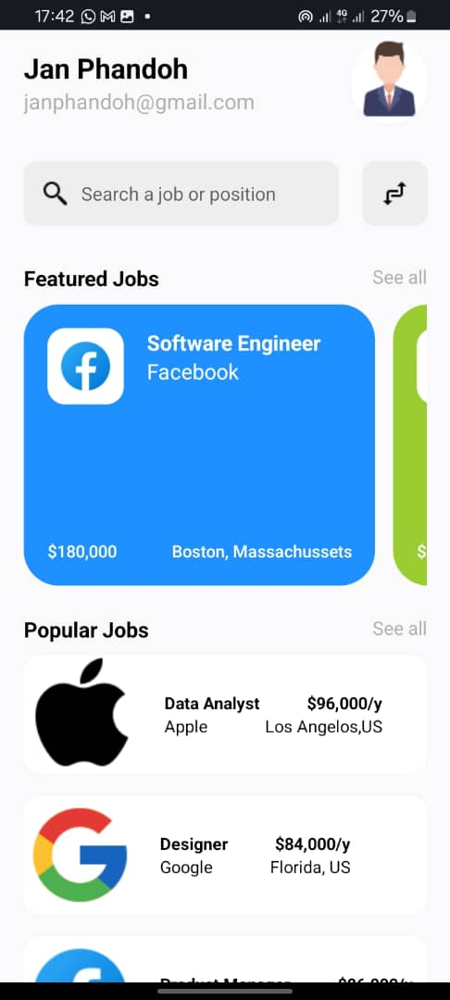

# Components

### Login Header

This is a component for the Login screen, it displays the App name and a welcome message.

### Form

This is also a component on the Login screen, that displays the text input for the logins of the user.

### IconsPanel

This component displays the icons on the Login screen.

### HomeHeader

This component displays the user's name, gmail and profile picture on the Home screen.

### SearchBar

The SearchBar component allows the user to search jobs.

### FeaturedJobs

This component shows a horizontal list of featured jobs.

### JobCard

This component displays a card for a particular job in the FeaturedJobs component.

### PopularJobs

This component shows a list of popular jobs.

### PopularJobscard

This component displays a card for a particular job in the PopularJobs component.

